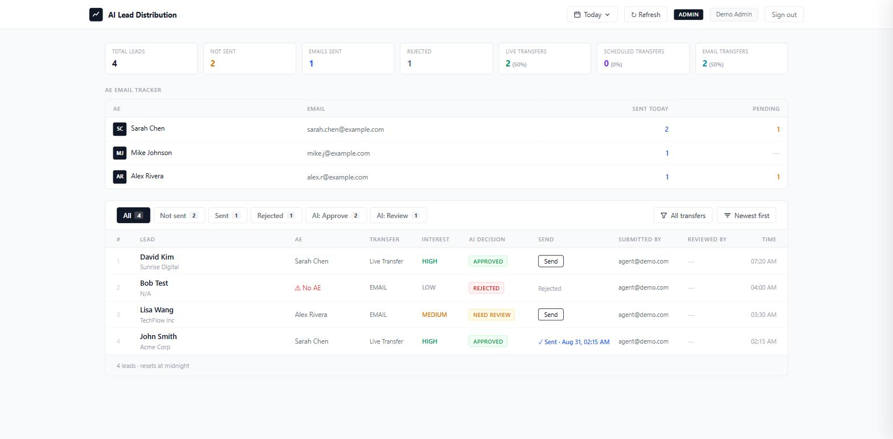
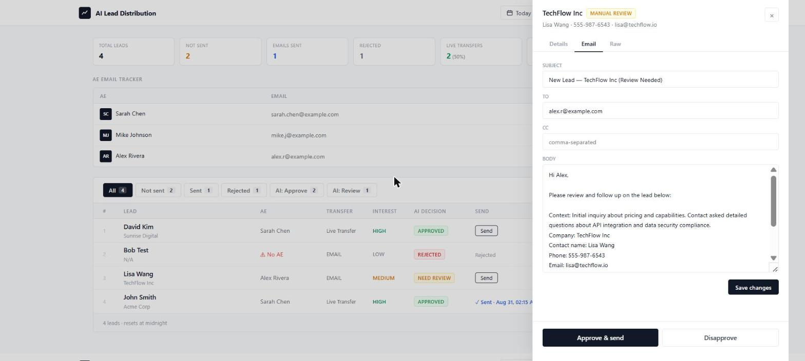
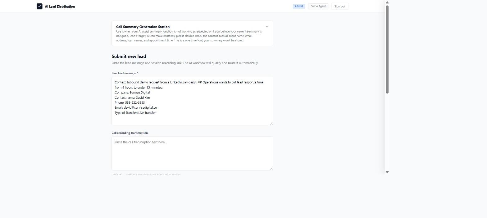

# AI Lead Distribution System

An AI-powered lead routing and outreach system that automates the full lifecycle
of inbound sales leads — from intake and qualification through AE assignment,
email generation, human review, and delivery tracking.

Built as a production tool to replace a manual lead handoff workflow with a
structured, AI-assisted pipeline.

## Try it

**[▶ Open the live demo](https://jinyufish.github.io/ai-lead-distribution-demo/)** — sign in as `admin@demo.com` for the
reviewer view or `agent@demo.com` for the agent view, password `demo` for both.

No setup, no backend, nothing to install: the frontend ships with a demo mode
that activates whenever `SUPABASE_URL` is left as a placeholder, so the whole UI
runs against sample data in the browser. Every screen below is reachable from
that link.



The reviewer dashboard: per-AE load tracking, transfer-type breakdown, and the
lead queue with its AI decision and send state.



Opening a lead shows the AI's decision and reasoning, and lets a reviewer edit
the drafted email before approving it.



Agents paste a raw lead message; the system parses it, qualifies it, assigns an
AE, and drafts the outreach email.

---

## How It Works

```
Lead submitted → AI qualification → Dedup check → AE assignment → Email draft → Human review → Send → Track
```

**1. Lead Intake**
Leads are submitted through the web UI by agents or pushed in programmatically via API. The frontend sends the raw lead message to a Supabase Edge Function, which proxies it server-side to the AI workflow (necessary to avoid browser CORS and mixed-content restrictions).

**2. AI Qualification**
The AI workflow analyzes the lead and returns a structured decision:
- **Approve** — includes a drafted outreach email (subject + body)
- **Manual Review** — flagged for human judgment
- **Disapprove** — logged but no action taken

Each decision includes an interest level score and an explanation of the reasoning.

**3. Deduplication**
Before saving, the system checks for existing leads matching the same contact name and phone number (phone normalized to last 10 digits). Duplicates return the existing record instead of creating a new entry.

**4. AE Assignment (Round-Robin Load Balancing)**
For approved and manual-review leads, the system assigns the least-loaded active AE (sales rep):
- Primary sort: fewest leads assigned today
- Tiebreak: fewest all-time sends
- Final tiebreak: AE ID

This ensures fair, balanced distribution without manual coordination.

**5. Status Routing**
- `approve` → Auto-assigns AE, sends the AI-drafted email immediately
- `manual_review` → Saved as `pending_manual_review`, awaits human action. If the AI didn't generate an email draft, a fallback template is applied so reviewers don't start from blank
- `disapprove` → Recorded for tracking, no assignment or outreach

**6. Human Review (Admin UI)**
Reviewers see all leads in a sortable table and can:
- Approve and send
- Disapprove
- Reverse a prior decision
- Edit email subject/body before sending

**7. Email Delivery**
The Edge Function (Deno runtime) cannot open SMTP sockets directly, so it delegates to a stateless SMTP relay authenticated with a shared-secret bearer token. The relay sends via Outlook/Office 365 (STARTTLS on port 587) using Nodemailer. The Edge Function remains the source of truth for delivery status — it updates each lead to `email_sent` with a timestamp based on the relay's response.

**8. Dashboard & Tracking**
Built-in AE stats view showing emails sent, pending counts, and per-date-range reporting — all driven from the same lead records.

---

## Tech Stack

| Layer | Technology |
|-------|-----------|
| Frontend | Vanilla HTML / CSS / JS (single-file admin + agent UI) |
| Backend Logic | Supabase Edge Function (Deno / TypeScript) |
| Database | Supabase (PostgreSQL) |
| AI Layer | LLM workflow via Dify (handles qualification, scoring, email drafting) |
| Email | Nodemailer → Outlook / Office 365 SMTP relay |
| Hosting | Vercel (static frontend + serverless email relay) + Supabase (Edge Function) |

---

## Key Design Decisions

- **Server-side AI proxy**: The Edge Function proxies AI requests to avoid CORS and mixed-content issues that would block direct browser-to-AI calls.
- **Stateless email relay**: Decouples email delivery from the Edge Function's runtime constraints (Deno can't open raw SMTP sockets). Authenticated via shared secret.
- **Edge Function as source of truth**: All status transitions (pending → approved → sent) are managed by the Edge Function, ensuring a single source of truth regardless of which relay or client triggers the action.
- **Dedup with phone normalization**: Prevents duplicate leads from different formatting of the same phone number.
- **Fallback email templates**: Ensures every reviewable lead has draft content, even when the AI doesn't generate one — reviewers never face a blank screen.

---

## Project Structure

```
├── index.html                        # Frontend — admin + agent UI, incl. demo mode
├── server.js                         # Local Express SMTP relay (development)
├── api/
│   └── send-email.js                 # Vercel serverless SMTP relay (production)
├── supabase/
│   ├── config.toml                   # Supabase project config
│   ├── seed.sql                      # Demo AEs and leads
│   ├── migrations/
│   │   └── 0001_init.sql             # Schema — tables, indexes, RLS
│   └── functions/
│       └── lead-distribution/
│           └── index.ts              # Edge Function — core routing logic
├── docs/                             # README screenshots
├── package.json
├── vercel.json                       # Vercel deployment config
└── .gitignore
```

---

## Setup

### Prerequisites
- Node.js
- A Supabase project with Edge Functions enabled
- A Vercel account (for serverless deployment)
- Outlook / Office 365 SMTP credentials
- A configured AI workflow endpoint (e.g., Dify)

### Environment Variables

**SMTP relay** — `.env` locally, Vercel project settings in production:

```
SMTP_HOST=smtp.office365.com
SMTP_PORT=587
SMTP_USER=your_email
SMTP_PASS=your_password
SENDER_NAME=Lead Distribution System   # optional From display name
RELAY_SECRET=your_shared_secret        # must match EMAIL_RELAY_SECRET below
PORT=3001                              # local Express relay only
```

**Edge Function** — set via `supabase secrets set`:

```
DIFY_BASE_URL=your_dify_endpoint
DIFY_API_KEY=your_dify_key
EMAIL_RELAY_URL=https://your-deployment/send-email
EMAIL_RELAY_SECRET=your_shared_secret  # must match RELAY_SECRET above
DEFAULT_CC_EMAIL=                      # optional CC on every outbound email
DEFAULT_EMAIL_SUBJECT=                 # optional fallback subject
DEFAULT_EMAIL_SIGNATURE=               # optional fallback signature
```

`SUPABASE_URL` and `SUPABASE_SERVICE_ROLE_KEY` are injected by the Supabase
runtime. The frontend's own `SUPABASE_URL` / `SUPABASE_ANON` live at the top of
`index.html`.

### Local Development

```bash
npm install
node server.js
```

### Database

```bash
supabase db push                  # apply supabase/migrations
psql "$DATABASE_URL" -f supabase/seed.sql   # optional demo rows
```

Edit the AE email addresses in `seed.sql` first — leads are routed to an AE and
the drafted email is sent to that AE's address, so they need to be inboxes you
can actually open.

### Deployment

- **Demo frontend**: served from this repo by GitHub Pages — `index.html` is
  fully self-contained, so no build step is involved.
- **Frontend + email relay**: Deploy to Vercel (`vercel --prod`)
- **Edge Function**: Deploy via Supabase CLI (`supabase functions deploy lead-distribution`)
